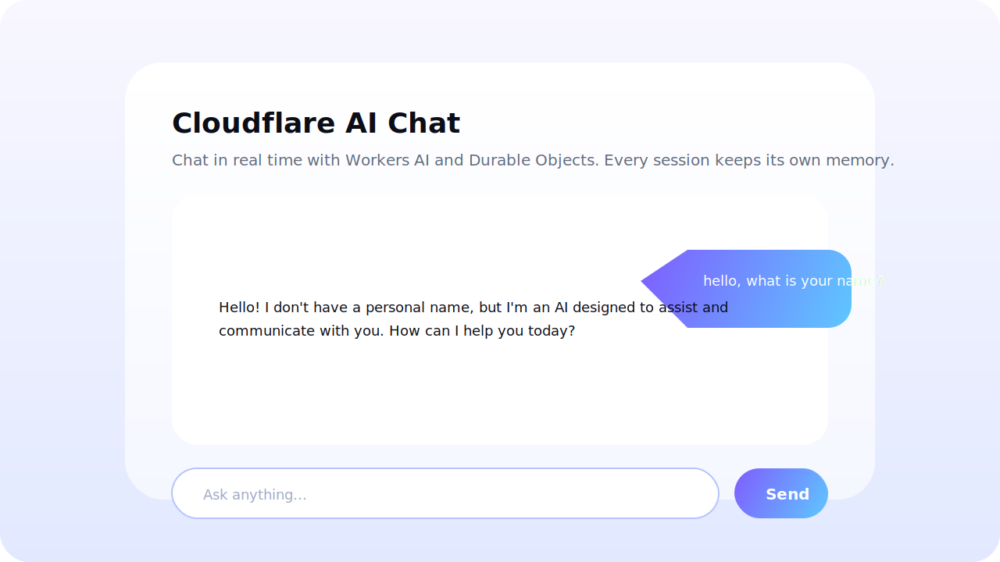

# Cloudflare AI Chat App

An AI-powered chat experience running entirely on Cloudflare’s developer platform.  
The Worker serves a beautiful Pages-style UI, routes chat messages through a Durable Object for per-session memory, and streams prompts to Workers AI (Llama 3 Instruct) for responses.



## Features
- **Workers AI (Llama 3 Instruct)** – generates natural-language responses for every user prompt.
- **Durable Object coordination** – each session gets its own `SessionDO`, which stores past messages so the LLM retains context.
- **Rich UI** – responsive layout, chat bubbles, loading indicator, and inline error handling.
- **Static assets via R2/Pages-style binding** – the Worker serves `/public` assets using the `ASSETS` binding defined in `wrangler.jsonc`.

## Project Structure
```
ai-app/
├── public/           # Front-end HTML/CSS/JS
├── src/index.js      # Worker + Durable Object logic
├── wrangler.jsonc    # Bindings, migrations, AI config
└── package.json      # Wrangler CLI dependency & scripts
```

## Getting Started
```bash
cd ai-app
npm install
export HOME=$PWD    # enables Wrangler log directory in sandboxed environments
npm run dev         # runs `wrangler dev`
```

Open the dev server URL from Wrangler and start chatting.  
The UI disables the Send button and shows “Thinking…” while the Worker awaits the AI response.

## Deployment
```bash
npm run deploy
```
This publishes the Worker, Durable Object migrations, and static assets using the bindings defined in `wrangler.jsonc`.

## Optional Assignment Checklist
- ✅ LLM via Workers AI (`@cf/meta/llama-3-8b-instruct`)
- ✅ Coordination with Durable Objects
- ✅ User chat UI hosted via Worker assets
- ✅ Memory/state persisted per session

Submit this repo URL (`https://github.com/Ahmed-ie/CloudFlare`) for review once deployed.
